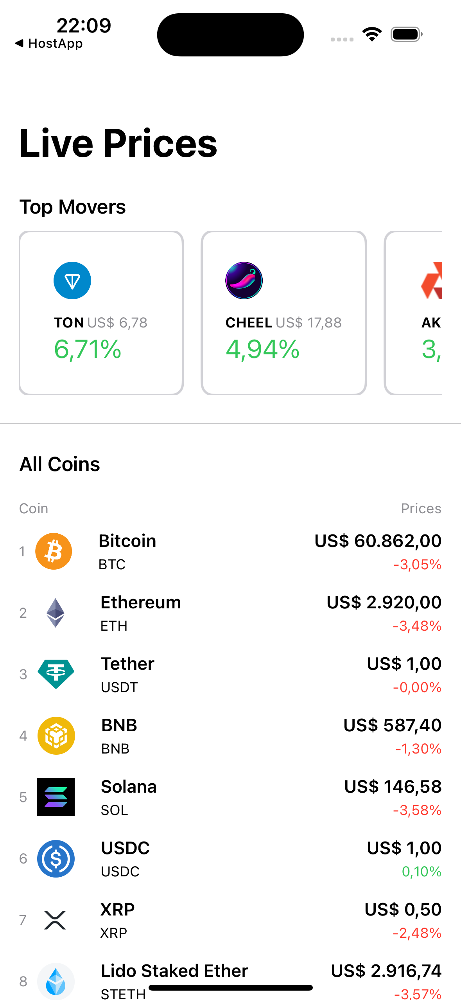
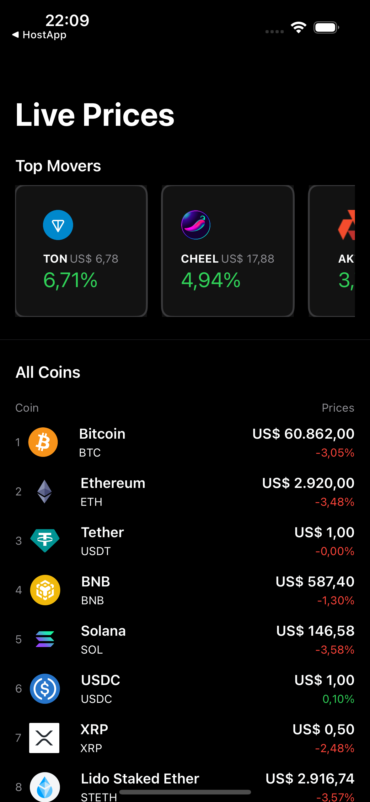
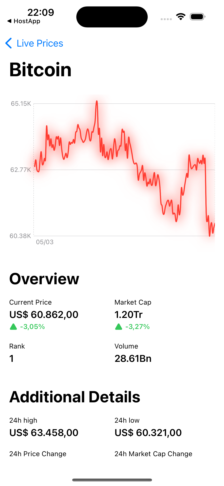

#  SwiftCoin

  
  
  

This project was initially build as part of a course on SwiftUI. However, to prectice learnt concepts and to improve the app, new features will be added, such as

- [] Use Firebase APIs for authentication and storage
- [] Create some additional screens to list user's portfolio and to simulate buy/sell operations
- [] Create a simple profile screen where user's can update profile pictures  

## 🚨 Known issues

## 🛠️ Environment Setup

Make sure you have a working MacOS with XCode installed

## 🚀 Running the project

1. Clone the repository
##
        git clone git@github.com:lucas-figueiredo-m/SwiftCoin.git
        
2. Using XCode, open `SwiftCoin.xcproject` inside of the cloned project
3. Select with device you'd like to run the app
4. Hit the play button on the top navigation bar. The selected emulator device should open and run the app

## 📝 License

This project is under license. See the file [LICENSE](LICENSE) for more details.

[⬆ Back to top](#SwiftCoin)
